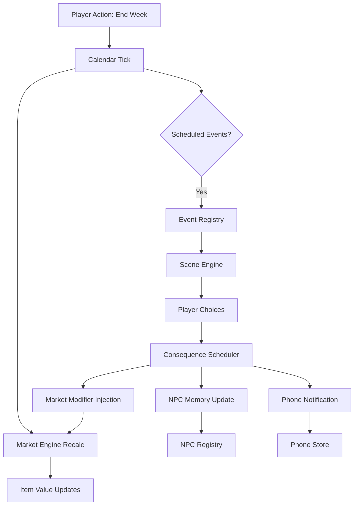

# ArtLife: Core Loop Specs (Phone, Calendar, and Scene Engines)

To execute the "Diegetic Desk" or "Minimal Web" UIs, the underlying systems feeding them must be incredibly robust. Sebastion and Antigravity have brainstormed three critical engines that ClaudeCode must build to support the narrative weight of V2.

---

## 1. The Phone / Notification System

The Phone is the primary vector for urgency and NPC interaction. It should be fully decoupled from the active Scene so it can interrupt the player at any time.

### Architecture
- **State (`PhoneStore.js`):** A Zustand store containing `messages`, `contacts`, and `notifications`.
- **The Data Structure:**
  ```javascript
  const messageObj = {
      id: "urg_deadline_01",
      senderId: "npc_gagosian",
      timestamp: "1988_wk32",
      text: "I need an answer on the Basquiat by Friday.",
      isRead: false,
      urgency: "HIGH", // Triggers red CSS badges
      choices: [
          { text: "Take the deal", actionId: "ACCEPT_BASQ", requires: { capital: 150000 } },
          { text: "Stall him", actionId: "STALL_DEALER", requires: { audacity: 60 } }
      ]
  };
  ```
- **UI Hooks:** The React shell listens to `usePhoneStore(state => state.getUnreadCount())`. If `> 0`, the phone icon on the desk vibrates or glowing red notification badge appears.
- **Interruption Mechanics:** If `urgency: "CRITICAL"`, the Phone overlay automatically forces its way onto the screen, pausing the background game loop until the player responds.

---

## 2. The Dynamic Calendar System

The Calendar is the pacing engine. It tells the player *when* to execute their goals and *when* disasters are coming.

### Architecture
- **State (`CalendarStore.js`):** Manages `currentWeek`, `currentYear`, and an array of `ScheduledEvents`.
- **The Data Structure:**
  ```javascript
  const scheduledEvent = {
      week: 42,
      year: 1990,
      type: "AUCTION", // AUCTION, EXHIBITION, DEADLINE, ERA_SHIFT
      title: "Sotheby's AI Preview",
      visibility: "PUBLIC", // 'HIDDEN' for secret narrative consequences
      isClickable: true,
      onTrigger: "load_scene_sothebys_auction"
  };
  ```
- **UI Hooks:** 
  - A scrollable "Timeline" component that shows the next 12 weeks.
  - Days turn RED as important deadlines approach.
  - Clicking a calendar event routes the player to the associated `Scene`.
- **The "Tick":** When the player clicks `[ End Week ]`, the Calendar advances. It checks if `currentWeek === scheduledEvent.week`. If true, it triggers the callback.

---

## 3. The Scene Engine (The Core Narrative Template)

The "Scene" is the master template for all gameplay interactions (going to an art fair, a private dinner, or a backroom deal). It needs to be flexible enough to handle pure dialogue, stat checks, and mini-games.

### Architecture
The Scene Engine is essentially a highly-upgraded version of the `DialogueScene.js` we built in V1, ported fully to React/Zustand.

- **The Flow:**
  1. Player clicks a location (e.g., "The Boom Boom Room").
  2. The `SceneEngine` mounts and loads the JSON object for that location.
  3. **Establishment:** Displays the background art, the NPC present, and flavor text.
  4. **The Interaction Loop:** A branching engine (like Ink, but JSON-based) that presents text and choices.
  
- **The Data Structure (The JSON Scene):**
  ```json
  {
    "sceneId": "boom_room_intro",
    "background": "club_vip_01.jpg",
    "npcsPresent": ["npc_margaux"],
    "steps": {
      "start": {
        "text": "The bass is rattling your molars. Margaux slides a folder across the table.",
        "choices": [
          { 
            "text": "Open the folder.", 
            "next": "reveal_forgery" 
          },
          { 
            "text": "Refuse to look.", 
            "require": { "stat": "audacity", "min": 50 },
            "next": "margaux_angry" 
          }
        ]
      },
      "reveal_forgery": {
         "type": "MINIGAME_HAGGLE",
         "target": "npc_margaux",
         "onWin": "acquire_fake",
         "onLose": "kicked_out"
      }
    }
  }
  ```

### Why This Engine Matters
By building the Scene Engine to accept purely abstract JSON, Seb can write 500 different events (dinners, betrayals, auctions) without ClaudeCode ever needing to write a new React Component. The Scene Engine just parses the JSON and builds the UI dynamically.

---

## 4. NPC / Character Registry

Every NPC in the game is defined as a single JSON object. The game engine reads these objects to populate dialogue, phone contacts, calendar attendance, and reputation tracking.

### The Data Structure
```javascript
const npc = {
    id: "npc_margaux",
    name: "Margaux Bellefleur",
    role: "Mega-Dealer",           // Dealer, Collector, Critic, Advisor, Hustler
    portrait: "portraits/margaux.png",
    sprite: "sprites/margaux_dealer.png",
    era: { start: 1975, end: 2020 }, // Active years (hidden outside this range)
    baseStats: {
        patience: 70,
        greed: 85,
        loyalty: 30,
        taste: 90
    },
    memory: {
        grudges: [],               // Populated at runtime by decisions
        favors: [],
        witnessed: [],
        lastContactWeek: null
    },
    dialogue: {
        greeting: "scene_margaux_greeting",
        haggleStyle: "AGGRESSIVE",
        personalityTraits: ["vindictive", "cultured", "impatient"]
    },
    schedule: [
        { week: 10, year: 1988, location: "art_basel" },
        { week: 32, year: 1988, location: "boom_boom_room" }
    ]
};
```

### How It Connects
- **The Phone** queries the NPC registry to populate the Contact List.
- **The Calendar** cross-references NPC schedules to show who will be at upcoming events.
- **The Scene Engine** loads NPC data to render portraits, set dialogue tone, and check relationship history.

---

## 5. The Event / Encounter Registry

Events are the random (or scheduled) narrative beats that fire between turns. They are the "short stories" that make each playthrough unique.

### The Data Structure
```javascript
const event = {
    id: "evt_basquiat_death",
    title: "The King Is Dead",
    category: "ERA_SHIFT",        // SCANDAL, OPPORTUNITY, SOCIAL, ERA_SHIFT, PERSONAL
    era: { year: 1988, week: 32 },
    isRepeatable: false,
    triggerConditions: {
        minWeek: 30,
        maxWeek: 34,
        yearEquals: 1988
    },
    gateRequirements: null,       // Or: { stat: "access", min: 60 }
    sceneId: "scene_basquiat_death",  // Links to Scene Engine JSON
    consequences: [
        { type: "MARKET_SHIFT", tags: ["neo-expressionism"], multiplier: 3.5 },
        { type: "UNLOCK_EVENT", eventId: "evt_assistant_sketches" },
        { type: "PHONE_MESSAGE", npcId: "npc_margaux", messageId: "msg_margaux_basquiat" }
    ],
    scheduledFollowUps: [
        { delayWeeks: 4, eventId: "evt_basquiat_price_surge" },
        { delayWeeks: 52, eventId: "evt_basquiat_retrospective" }
    ]
};
```

### How It Connects
- **The Calendar** fires events when `currentWeek` matches `triggerConditions`.
- **The Scene Engine** renders the event using `sceneId`.
- **The Consequence Scheduler** queues `scheduledFollowUps` for delayed ripple effects.

---

## 6. Items & Inventory System

Items are physical objects the player owns: artworks, documents, luxury goods, contraband.

### The Data Structure
```javascript
const item = {
    id: "item_basquiat_crown_sketch",
    name: "Untitled Crown Sketch (1987)",
    type: "ARTWORK",              // ARTWORK, DOCUMENT, LUXURY, CONTRABAND
    artistId: "artist_basquiat",
    tags: ["neo-expressionism", "works-on-paper", "provenance-verified"],
    acquisition: {
        method: "PURCHASE",       // PURCHASE, GIFT, STOLEN, INHERITED
        price: 15000,
        week: 34,
        year: 1988,
        fromNpcId: "npc_assistant"
    },
    currentValue: 15000,          // Updated each week by MarketEngine
    rarity: "RARE",               // COMMON, UNCOMMON, RARE, LEGENDARY
    provenance: ["Estate of J.M. Basquiat", "Private Collection"],
    flags: {
        isForgery: false,
        isStolen: false,
        isFreeported: false,
        isOnLoan: false
    }
};
```

### How It Connects
- **The Market Engine** recalculates `currentValue` each week based on artist heat, tags, rarity, and era modifiers.
- **The Haggle Engine** uses the item as the object of negotiation.
- **The Desk UI** physically displays owned artworks as clickable objects on the player's desk.
- **The Admin Dashboard** shows a full inventory audit with acquisition history.

---

## 7. Art Pricing & Market Simulation

The market is driven by a combination of artist-level heat scores, global economic modifiers, and tag-based era shifts.

### The Data Structures

#### Artist Profile
```javascript
const artist = {
    id: "artist_basquiat",
    name: "Jean-Michel Basquiat",
    tags: ["neo-expressionism", "downtown-scene", "american"],
    era: { peakStart: 1982, peakEnd: 1988, deathYear: 1988 },
    baseHeat: 75,                 // 0-100, modified by events
    heatHistory: [],              // [{week, year, heat}] — populated at runtime
    priceFloor: 5000,             // Minimum price for any work
    priceCeiling: 50000000,       // Maximum price (post-death blue-chip)
    volatility: 0.15              // How much price swings per week (0.0 - 1.0)
};
```

#### Global Economic State
```javascript
const economicState = {
    currentEra: "1980s_BOOM",
    marketCondition: "BULL",      // BULL, BEAR, FLAT, CRASH, BUBBLE
    interestRate: 0.08,
    inflationRate: 0.04,
    activeModifiers: [
        { id: "mod_reagan_tax_cuts", effect: { tags: ["blue-chip"], multiplier: 1.3 } },
        { id: "mod_cocaine_economy", effect: { tags: ["downtown-scene"], multiplier: 1.8 } }
    ],
    weeklyPriceFormula: "basePrice * artistHeat * marketMultiplier * eraModifier * (1 + random(-volatility, +volatility))"
};
```

### How It Connects
- **Every `[ End Week ]` tick**, the Market Engine iterates over all artists, recalculates heat, and updates every item's `currentValue`.
- **Era Events** (from the Event Registry) inject new `activeModifiers` into the economic state (e.g., the 2008 crash sets `marketCondition: "CRASH"` and adds a `{ tags: ["all"], multiplier: 0.5 }` modifier).
- **The Player Dashboard** reads the economic state to render the Net Worth graph and portfolio performance.
- **The Calendar** shows upcoming auctions where prices are influenced by the current `marketCondition`.

---

## System Interconnection Map


