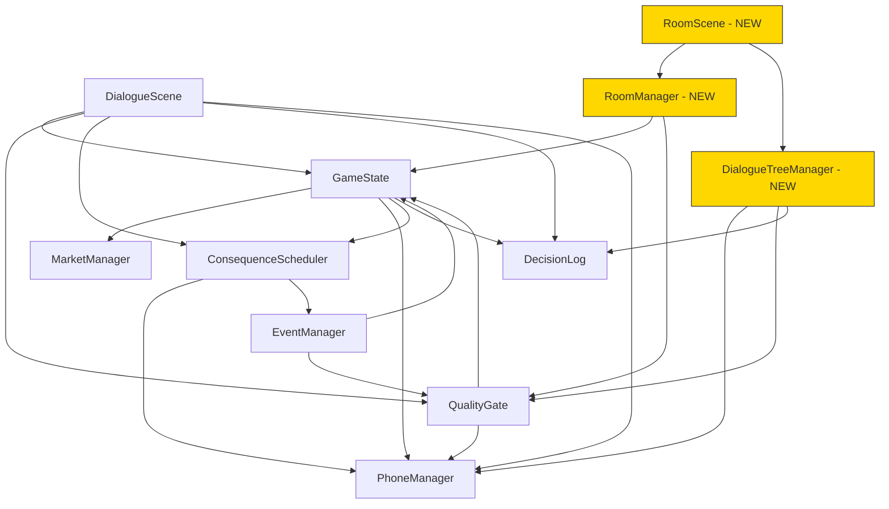

# 🗺️ ArtLife — Implementation Plan

> Expanding ArtLife from an event-loop strategy game into a full text adventure with navigable rooms, branching dialogue trees, and atmospheric noir prose.

---

## Table of Contents

1. [Research Foundations](#research-foundations)
2. [Architecture](#architecture)
3. [Phase A: Content Design](#phase-a-content-design-markdown-files)
4. [Phase B: Code Implementation](#phase-b-code-implementation)
5. [Phase C: System Integration](#phase-c-system-integration)
6. [Future Phases](#future-phases)

---

## Research Foundations

### Games Studied & Key Takeaways

| Game | Engine | Key Mechanic Adopted | Implementation in ArtLife |
|---|---|---|---|
| **Enclosure 3D** | Sierra AGI (NAGI) | Room → exit → item → character → topic data model | Room schema, click-based exploration (not text parser) |
| **Maniac Mansion** | SCUMM | Multi-character puzzles, verb simplification (40→9), cutscenes | Character-class-dependent venue interactions, click UI |
| **Fallen London** | Quality-Based Narrative | Blue Options (stat-gated special choices) | `QualityGate.js` — already built |
| **Roadwarden** | Custom | 5 conversation tones, time budgets | 5-tone dialogue system (Phase A2) |
| **Root of Harmony** | Custom | Doctrine system affecting character evolution | Dominant tone → Week 20 character specialization |
| **The Crimson Diamond** | Adventure Game Studio | Eavesdropping, notebook mechanics | Room eavesdrop system, DecisionLog |
| **Overboard!** | Ink | NPC memory, autonomous behavior | `PhoneManager` witnessed/grudges/favors — already built |
| **King of Dragon Pass** | Custom | Delayed consequences | `ConsequenceScheduler.js` — already built |
| **Sir Brante** | Unity | Decision journal with stat snapshots | `DecisionLog.js` — already built |
| **Banner Saga** | Custom | Resource scarcity creating moral dilemmas | Anti-resources (Heat, Suspicion, Burnout) — already built |
| **FTL** | Custom | Micro-decisions snowballing | Oregon Trail event pacing (70-98% per turn) — already built |
| **A Dark Room** | Browser JS | Progressive disclosure | UI revelation through gameplay — Phase 4 |

### Maniac Mansion Deep Dive

Key architectural lessons from studying the SCUMM engine:

1. **Verb Simplification:** Original design had 40 verbs → shipped with 12 → Monkey Island used 9 → MI3 used icons. Our click-based UI already solves this — room items show only relevant actions.
2. **Multi-Character Party:** 3 of 7 characters with unique skills, creating different puzzle solutions and endings. Our 3 character classes (Rich Kid, Hedge Fund, Insider) should have similar divergence in venue access and NPC interactions.
3. **Room Architecture:** 6-floor mansion organized as interconnected rooms with locked doors requiring items/keys. Our venues follow the same pattern with QualityGate requirements instead of inventory keys.
4. **Cutscenes:** Term coined by the MM team. Timer-triggered or action-triggered non-interactive sequences showing what happens elsewhere. Future phase: inter-week cutscenes showing NPC autonomous behavior.
5. **Design Process:** Started as a paper-and-pencil board game — mansion floor plan was the game board. Our markdown-first content design mirrors this approach.

### Enclosure 3D Architecture

Study of the Sierra AGI engine (via NAGI/RVX):
- Rooms as state nodes with `LOOK`, `EXAMINE`, `TALK TO`, `USE` verbs
- NPCs have topic lists — select character → select topic → get response
- Priority screens gate walkable areas (our QualityGate equivalent)
- We adopt the data model (rooms, exits, items, characters, topics) but render as clickable UI panels

---

## Architecture

### Current Game Flow

```
MenuScene → CharacterSelectScene → GameScene ⟷ DialogueScene → EndScene
                                      │
                                      ├── Advance Week
                                      │   ├── MarketManager.tick()
                                      │   ├── PhoneManager.npcAutonomousTick()
                                      │   ├── PhoneManager.generateTurnMessages()
                                      │   ├── ConsequenceScheduler.tick(week)
                                      │   └── EventManager.checkForEvent()
                                      │
                                      └── Event found → DialogueScene
```

### Expanded Game Flow (After Phase B+C)

```
GameScene ─── Advance Week ─── Event Roll ─── { Event Type }
                                                    │
                                    ┌───────────────┼───────────────┐
                                    │               │               │
                              Standard Event   Venue Visit    Chain Event
                                    │               │               │
                              DialogueScene    RoomScene      DialogueScene
                              (existing)       (NEW)          (multi-step)
                                                    │
                                              ┌─────┴─────┐
                                         Explore Rooms   Talk to NPCs
                                         Examine Items   Eavesdrop
                                         Gated Exits     Leave → Hub
                                              │
                                         DialogueTreeManager (NEW)
                                         ├── Tone Selection
                                         ├── Topic-based branching
                                         ├── QualityGate checks
                                         └── NPC memory integration
```

### System Dependencies



---

## Phase A: Content Design (Markdown Files)

> All room content, NPC dialogues, and venue encounters authored as markdown. No code changes in this phase.

---

### A1 ✅ Room Schema + First 2 Venues

**Completed.** Created:
- [Room_Schema.md](../05_World/Room_Schema.md) — Data format spec
- [Gallery_Opening.md](../05_World/Rooms/Gallery_Opening.md) — 4 rooms, 12 items, 4 NPCs, 4 eavesdrops
- [Cocktail_Party.md](../05_World/Rooms/Cocktail_Party.md) — 5 rooms, 15+ items, 5 NPCs, 3 eavesdrops

---

### A2 — Dialogue Trees V2 🔴 IN PROGRESS (Agent-1)

**Deliverable:** `04_Events/Dialogue_Trees_V2.md`

#### 5-Tone Conversation System

Inspired by Roadwarden (5 tones) + Root of Harmony (doctrine shaping character evolution):

| Tone | Icon | Best NPCs | Risk | Stat Lean |
|---|---|---|---|---|
| Friendly 🤝 | 🤝 | Artists, curators | Too slow for deals | +reputation |
| Schmoozing 🎭 | 🎭 | Collectors, socialites | Seen as superficial if overused | +intel |
| Direct 🗡️ | 🗡️ | Dealers, time-sensitive deals | Offends old guard | +cash efficiency |
| Generous 💎 | 💎 | Struggling galleries, young artists | Drains cash, favor | +NPC favor |
| Ruthless 🔥 | 🔥 | Rivals, auctions, market moves | Burns bridges permanently | +marketHeat |

**Tone tracking:** Each conversation logs the tone used. After Week 20, the player's dominant tone triggers character specialization:

| Dominant Tone | Specialization | Bonus |
|---|---|---|
| Friendly | The Patron | Artist loyalty: +50% on artist-initiated offers |
| Schmoozing | The Insider | Intel from every conversation, even failed ones |
| Direct | The Shark | 15% discount on all primary market purchases |
| Generous | The Benefactor | Museum board invitation (late-game power) |
| Ruthless | The Predator | Can force NPC intel reveals, but favor cap -30 |

#### Dialogue Tree Node Format

```javascript
{
    id: 'elena_ross_gallery_opening',
    npcId: 'elena_ross',
    venue: 'gallery_opening',          // Where this tree activates
    entryConditions: null,             // QualityGate — null = always available
    nodes: {
        'start': {
            speaker: 'elena_ross',
            text: '"Welcome! I\'m so glad you came..."',
            topics: [
                {
                    label: 'Ask about the new exhibition',
                    tone: null,                // Any tone works
                    requires: null,
                    next: 'exhibition_topic',
                },
                {
                    label: 'Inquire about available works',
                    tone: 'direct',
                    requires: { reputation: { min: 30 } },
                    next: 'available_works',
                    isBlueOption: true,
                },
                {
                    label: 'Leave conversation',
                    next: null,                // null = exit tree
                }
            ],
        },
        'exhibition_topic': {
            speaker: 'elena_ross',
            text: '"This is Yuki\'s strongest body of work yet..."',
            effects: { intel: 1 },
            npcEffects: { elena_ross: { favor: 1 } },
            topics: [
                { label: 'Ask about Yuki\'s prices', next: 'yuki_prices' },
                { label: 'Compliment the curation', tone: 'friendly', next: 'curation_compliment' },
                { label: 'End conversation', next: null }
            ],
        },
        // ... more nodes
    },
    onComplete: {
        effects: {},
        schedules: [],
    }
}
```

#### Initial Trees (2 NPCs)

**Elena Ross** (gallerist, Chelsea) — 3 conversation branches:
1. **Gallery Opening** — discussing new works, artist access, buying opportunities
2. **Follow-up** (requires prior meeting) — exhibition review, studio visit invitation
3. **Conflict** (if player flipped an artist she represents) — confrontation tree

**Philippe Noir** (old-guard collector) — 3 conversation branches:
1. **First Meeting** — formal introduction, testing player's knowledge
2. **Dinner Invitation** (requires favor ≥ 5) — private collection viewing, deaccession offers
3. **Collaboration** (requires favor ≥ 15) — joint acquisition proposal

---

### A3 — Venue Encounters

**Status:** Not started (after A2)
**Deliverable:** `04_Events/Venue_Encounters.md`

10 scripted encounters triggered by room + condition:

| # | Name | Trigger Location | Gate | Effect |
|---|---|---|---|---|
| 1 | The Overheard Forgery | Auction Viewing Room | Own same artist | Provenance crisis: keep or report |
| 2 | The Red Dot | Gallery Main Floor | Cash ≥ $20K | Pre-sale buying window |
| 3 | The Backroom Deal | Gallery Backroom | Rep ≥ 50 | Exclusive below-market offer |
| 4 | The Drunk Collector | Cocktail Terrace | Late in visit | Distressed sale intel |
| 5 | Studio Revelation | Artist Studio | 4+ works | Private commission offer |
| 6 | The Uninvited Guest | Any venue | Rival NPC present | Forced confrontation |
| 7 | The Artist's Confidence | Gallery + artist present | Own 2+ works | Studio visit invitation |
| 8 | The Toast | Cocktail Living Room | Host present | Speech event — 3 choices |
| 9 | The Offer You Can't Refuse | Cocktail Study | Host favor ≥ 8 | Below-market piece |
| 10 | The Auction Whisper | Auction Lounge | Intel ≥ 7 | Lot manipulation intel |

Each includes: trigger conditions, atmospheric noir prose, 3-4 choices with effects, consequence scheduling.

---

### A4 ✅ Remaining 4 Venue Files (Completed by Agent-2)

**Completed.** All 4 venue files created in `05_World/Rooms/`:

| File | Rooms | Key NPCs | Notes |
|---|---|---|---|
| [Auction_House.md](../05_World/Rooms/Auction_House.md) | 4 (Main Hall, Bidding Floor, Private Viewing, Cashier) | Marcus Price, Senior Specialist | Competitive bidding, lot examination, eavesdrop on third-party guarantees |
| [Art_Fair_Basel.md](../05_World/Rooms/Art_Fair_Basel.md) | 4 (Exhibition Hall, Blue Chip Booth, VIP Lounge, Loading Dock) | Lorenzo Gallo, Baroness von H | Time pressure (4 actions), First Choice VIP gating (Rep ≥ 70) |
| [Artist_Studio.md](../05_World/Rooms/Artist_Studio.md) | 4 (Street, Studio Floor, Vault, Roof) | Kwame Asante | Intimacy mechanics, direct sales at 50% market, artist favor gating |
| [Freeport.md](../05_World/Rooms/Freeport.md) | 4 (Security, Vault Corridor, Private Viewing, Registry) | Charles Vandermeer | Tax evasion, wartime provenance, character-class variations, FINMA intel |

> **For Agent-1 (Dialogue Trees V2):** The following NPCs appear in both venue files and may need dialogue trees:
> - **Lorenzo Gallo** — Art Basel mega-dealer, topics: european_market, venice_biennale, tax_havens
> - **Charles Vandermeer** — Freeport storage advisor, topics: storage_options, tax_optimization, insurance_valuation, provenance_concerns, purchase_structure, discretion
> - **Kwame Asante** — Bushwick artist, topics: work_in_progress, gallery_pressure, inspiration, future_plans, leaving_new_york
> - **Marcus Price** — Auction House advisor, topics: tonight_estimates, client_gossip, market_correction

---

### A5 — Update Existing Docs

**Status:** Not started (after A2 + A4)
**Files:** Modify `05_World/Locations.md`, `04_Events/Dialogue_Trees.md`

- Add venue lists per city with room file cross-references
- Add Tone System section to Dialogue_Trees.md
- Link venue encounters to room data

---

## Phase B: Code Implementation

> ⚠️ **Do not start Phase B until Phase A content is finalized and approved.**

### B1 — Data Files

**New files:**
- `game/src/data/rooms.js` — All venue/room data as JS objects
- `game/src/data/dialogue_trees.js` — All NPC conversation trees

Convert markdown venue files into JavaScript. Each room becomes a JS object matching Room_Schema. Each dialogue tree becomes a node graph.

### B2 — Manager Classes

**New files:**
- `game/src/managers/RoomManager.js`
- `game/src/managers/DialogueTreeManager.js`

#### RoomManager API

```javascript
export class RoomManager {
    static currentVenue = null;
    static currentRoom = null;
    static timeRemaining = 0;
    static visitedRooms = [];

    // Venue lifecycle
    static enterVenue(venueId)          // Init visit, set time budget, enter startRoom
    static leaveVenue()                 // Return to Hub, log visit

    // Navigation
    static moveToRoom(roomId)           // Check exit gates via QualityGate, deduct time
    static getAvailableExits()          // Filter exits by requirements

    // Interaction
    static getInteractables()           // Items visible to current player stats
    static examineItem(itemId)          // Show desc, apply onLook effects
    static getCharacters()              // NPCs in current room
    static getEavesdrops()              // Available intel opportunities
    static consumeEavesdrop(eavesId)    // Apply effects, mark as used

    // State queries
    static getTimeRemaining()
    static getCurrentRoom()
    static hasVisitedRoom(roomId)
}
```

#### DialogueTreeManager API

```javascript
export class DialogueTreeManager {
    static currentTree = null;
    static currentNodeId = null;
    static selectedTone = null;
    static conversationLog = [];

    // Conversation lifecycle
    static startConversation(npcId, venue)    // Load tree, check entry conditions
    static endConversation()                  // Apply onComplete effects, log to DecisionLog

    // Tone
    static selectTone(tone)                   // Set conversation tone
    static getToneOptions()                   // Which tones are available for this NPC

    // Navigation
    static getCurrentNode()                   // Current dialogue node
    static getVisibleTopics()                 // Filter by QualityGate + tone + NPC memory
    static advanceToNode(nodeId)              // Move to next node, apply node effects

    // State
    static isInConversation()
    static getConversationHistory(npcId)      // Past conversations with this NPC
}
```

### B3 — RoomScene (New Phaser Scene)

**New file:** `game/src/scenes/RoomScene.js`

Click-based room exploration. Display layout:

```
┌─────────────────────────────────────────────────┐
│  📍 Gallery Opening — Main Floor       ⏱️ 4/5   │
├─────────────────────────────────────────────────┤
│                                                 │
│  [Atmospheric description text with             │
│   typewriter reveal animation]                  │
│                                                 │
├───────────────────┬─────────────────────────────┤
│  EXAMINE          │  PEOPLE                     │
│  ○ Price list     │  ○ Elena Ross               │
│  ○ Guest book     │  ○ Gallery assistant         │
│  ○ Canvas         │                             │
├───────────────────┤  LISTEN                     │
│  GO               │  ○ Dealers whispering       │
│  ○ Backroom  🔒   │  ○ Phone call overhead      │
│  ○ Street         │                             │
│  ○ Storage   🔒   │                             │
├───────────────────┴─────────────────────────────┤
│  [LEAVE VENUE]                                  │
└─────────────────────────────────────────────────┘
```

**Interactions:**
- Click item → show `desc` text, apply `onLook` effects
- Click NPC → launch DialogueTreeManager with tone selection
- Click exit → `RoomManager.moveToRoom()`, check gate
- Click eavesdrop → show `content`, apply effects, mark consumed
- Click Leave → `RoomManager.leaveVenue()`, return to GameScene
- 🔒 icon on exits where `QualityGate.check()` fails

### B4 — DialogueScene Modifications

**File:** `game/src/scenes/DialogueScene.js` (MODIFY)

Add two new step types to the existing multi-step engine:

```javascript
// New step type: room_enter
{ type: 'room_enter', venueId: 'gallery_opening' }
// → Transitions to RoomScene instead of advancing to next step

// New step type: dialogue_tree
{ type: 'dialogue_tree', npcId: 'elena_ross', venue: 'gallery_opening' }
// → Launches DialogueTreeManager overlay with tone selection
```

Register `RoomScene` in `main.js` scene list.

---

## Phase C: System Integration

### C1 — Wiring

**Files to modify:**
- `EventManager.js` — New event type `venue_visit` routes to RoomScene instead of DialogueScene
- `GameState.js` — New state fields: `currentLocation`, `roomsVisited: []`, `conversationHistory: []`, `toneHistory: []`, `dominantTone: null`
- `PhoneManager.js` — Reference room visits in NPC messages ("I saw you at the gallery...")
- `main.js` — Register RoomScene

### C2 — Testing & Verification

| Test | Expected |
|---|---|
| `npx vite build --mode development` | 0 errors |
| Open venue from event | RoomScene loads with correct venue data |
| Navigate rooms | Exits work, gated exits show 🔒 |
| Talk to NPC | Tone selection → topic tree → effects applied |
| Eavesdrop | One-shot intel, effects applied |
| Time runs out | Forced venue exit |
| Leave venue | Return to GameScene hub |
| Existing events | Still work alongside room system |

---

## Future Phases (Post Room System)

### From Maniac Mansion

1. **Character-Class-Dependent Puzzles** — Different classes unlock different items, exits, and NPC topics within the same venue
2. **Cutscenes** — Timer-triggered inter-week sequences showing NPC autonomous behavior ("Meanwhile, Elena Ross meets with Philippe Noir...")
3. **Multi-Character Party** — Bring an NPC ally to a venue for different interaction options
4. **Progressive Verb Reveal** — Start with LOOK + GO, unlock EXAMINE + TALK as reputation grows

---

## V2: Production-Grade System Blueprints

> **Context:** Everything above covers the V1 room/dialogue system. This section covers the V2 architecture overhaul: new state management, a professional narrative engine, the content management studio, and the market simulation engine. These are all documented in their respective `_Spec.md` files; this section provides **implementation-ready code patterns and error handling** for ClaudeCode.

### Critical-Path Build Order

> [!CAUTION]
> Systems MUST be built in this dependency order. Building out of sequence creates phantom dependencies.

```
1. Zustand Stores (foundation — everything reads from these)
   ↓
2. inkjs SceneEngine (narrative core — renders all dialogue/events)
   ↓  
3. CalendarStore (time system — triggers events on week advance)
   ↓
4. PhoneStore (notifications — interrupts from NPCs)
   ↓
5. EventRegistry (triggers + consequences — reads from Calendar, fires Scenes)
   ↓
6. NPCRegistry (memory + schedule — reads from Events, writes to Phone)
   ↓
7. MarketEngine (price recalc — reads era modifiers from Events)
   ↓
8. InventoryStore (item values — reads from Market)
   ↓
9. Content Management Studio (dev tooling — reads from ALL stores)
```

---

### V2.1 — Zustand Store Architecture

**Package:** `zustand@5`, `immer@10`

All V2 game state lives in modular Zustand stores communicating via a central `GameTick` function (never via direct cross-store subscriptions, which cause circular dependency bugs).

**Critical Pattern: The `immer` middleware**
```javascript
import { create } from 'zustand';
import { immer } from 'zustand/middleware/immer';

export const useGameStore = create(
    immer((set, get) => ({
        currentWeek: 1,
        currentYear: 1980,
        capital: 50000,
        stats: { hyp: 50, tst: 50, aud: 50, acc: 50 },
        
        advanceWeek: () => set((state) => {
            state.currentWeek += 1;
            if (state.currentWeek > 52) {
                state.currentWeek = 1;
                state.currentYear += 1;
            }
        }),
        
        setCapital: (val) => set((state) => { state.capital = val; }),
        getTime: () => ({ week: get().currentWeek, year: get().currentYear }),
    }))
);
```

**Error Handling:**
| Risk | Mitigation |
|---|---|
| Store accessed before hydration | Default values always present. `persist` middleware for save/load. |
| Circular subscriptions | **Rule:** Stores never `subscribe()` to each other. The `GameTick` function calls them in sequence. |
| localStorage quota exceeded | Wrap `persist` in try/catch. Disable autosave, warn user. |
| State corruption from rapid mutations | Immer makes all mutations produce new immutable objects. Race conditions impossible. |

---

### V2.2 — Scene Engine (inkjs Integration)

**Package:** `inkjs@2.3`

**Why inkjs replaces our custom JSON branching parser:**
- `.ink` scripts read like screenplays — dramatically faster for Seb to author than nested JSON
- Handles branching, variables, conditionals, loops, and functions natively
- Variable observation enables bidirectional sync with Zustand
- Used by *80 Days*, *Heaven's Vault* — battle-tested in shipping games
- The compiler can be excluded from production builds (build-time only)

**The Core Loop (pulled from actual inkjs API):**

```javascript
// src/engines/SceneEngine.js
import { Story } from 'inkjs';

export class SceneEngine {
    constructor(compiledInkJson) {
        this.story = new Story(compiledInkJson);
        this._bindGameVariables();
    }

    // Advance story to next choice point. Returns renderable state.
    continue() {
        const paragraphs = [];
        const allTags = [];
        while (this.story.canContinue) {
            const line = this.story.Continue();
            if (line.trim()) paragraphs.push(line.trim());
            allTags.push(...(this.story.currentTags || []));
        }
        return {
            text: paragraphs,
            choices: this.story.currentChoices.map((c, i) => ({
                index: i, text: c.text, tags: c.tags || []
            })),
            tags: allTags,
            isEnd: !this.story.canContinue && this.story.currentChoices.length === 0
        };
    }

    // Player makes a choice. Validates input.
    choose(index) {
        if (index < 0 || index >= this.story.currentChoices.length) {
            console.error(`[SceneEngine] Bad choice: ${index}`);
            return this.continue(); // Re-render current state as fallback
        }
        this.story.ChooseChoiceIndex(index);
        return this.continue();
    }

    // Jump to a named section (knot). Used by EventRegistry routing.
    goToKnot(name) {
        try {
            this.story.ChoosePathString(name);
        } catch (e) {
            console.error(`[SceneEngine] Knot "${name}" missing, falling back to start`);
            this.story.ChoosePathString('start');
        }
        return this.continue();
    }

    // Sync game stats INTO ink before scene starts
    _bindGameVariables() {
        const gs = useGameStore.getState();
        const vars = this.story.variablesState;
        vars['player_capital'] = gs.capital || 0;
        vars['player_aud'] = gs.stats?.aud || 0;
        vars['player_tst'] = gs.stats?.tst || 0;
        vars['player_acc'] = gs.stats?.acc || 0;
        
        // Observe ink → Zustand (bidirectional)
        this.story.ObserveVariable('player_capital', (_, val) => {
            useGameStore.getState().setCapital(val);
        });
    }

    // Save/load for save games
    saveState()      { return this.story.state.toJson(); }
    loadState(json)  {
        try { this.story.state.LoadJson(json); }
        catch (e) { console.error('[SceneEngine] Corrupt save, restarting scene'); }
    }

    destroy() { this.story = null; }
}
```

**What `.ink` scripts look like (author-friendly format):**
```ink
// scenes/boom_room.ink
VAR player_aud = 0

=== start ===
The bass is rattling your molars. Margaux slides a folder across the table.
# background: club_vip_01.jpg
# npc: npc_margaux

+ [Open the folder.]
    -> reveal_forgery
+ {player_aud >= 50} [Refuse to look.]
    -> margaux_angry

=== reveal_forgery ===
Inside: certificates for three Basquiat sketches. They look... almost real.
# trigger: MINIGAME_HAGGLE
# target: npc_margaux
-> END
```

**How tags drive the game (the IPC system):**
When inkjs outputs `# trigger: MINIGAME_HAGGLE`, the React render layer parses the tag and mounts the Haggle Battle component instead of continuing dialogue. Tags are the communication protocol between the narrative engine and the game systems:

| Tag Pattern | System Triggered |
|---|---|
| `# background: <file>` | React renders new background image |
| `# npc: <npcId>` | React renders NPC portrait from registry |
| `# trigger: MINIGAME_HAGGLE` | Mounts HaggleBattle component |
| `# consequence: <effectId>` | Pushes to ConsequenceScheduler |
| `# phone_message: <msgId>` | Pushes message to PhoneStore |
| `# market_shift: <tag>:<mult>` | Injects modifier into MarketEngine |
| `# unlock_event: <eventId>` | Adds event to CalendarStore |

**Error Handling:**
| Risk | Mitigation |
|---|---|
| `.ink.json` fails to load | try/catch in fetch. Show "Scene Unavailable" fallback with "Return to Dashboard" button. |
| Choice index out of bounds | `choose()` validates and falls back to re-render. |
| Ink variable not found | Optional chaining + default to 0. Log warning, don't throw. |
| Story reaches END unexpectedly | Return `{ isEnd: true }`. React routes back to Calendar. |
| Tags contain malformed data | Defensive `parseTag()` helper: split on `:`, validate both sides. |
| Corrupted save state | try/catch on `LoadJson()`. On failure, restart scene from beginning. |

---

### V2.3 — The Master Game Tick

> [!IMPORTANT]
> This is the single most critical function. If it breaks, the entire game freezes.

```javascript
// src/engines/GameTick.js
export function executeWeekTick() {
    const time = useGameStore.getState().getTime();
    useGameStore.getState().advanceWeek();
    const newTime = useGameStore.getState().getTime();

    // Each step wrapped in try/catch — one system crash must NOT break the tick
    let triggeredEvents = [];
    
    try { triggeredEvents = useCalendarStore.getState().getTriggeredEvents(newTime.week, newTime.year); }
    catch (e) { console.error('[Tick] Calendar failed:', e); }
    
    try { useConsequenceStore.getState().fire(newTime.week, newTime.year); }
    catch (e) { console.error('[Tick] Consequences failed:', e); }
    
    try { useMarketStore.getState().recalculate(newTime); }
    catch (e) { console.error('[Tick] Market failed:', e); }
    
    try { useNPCStore.getState().tickAutonomous(newTime); }
    catch (e) { console.error('[Tick] NPC tick failed:', e); }
    
    try { useInventoryStore.getState().revalueAll(); }
    catch (e) { console.error('[Tick] Inventory revalue failed:', e); }

    return triggeredEvents;
}
```

**Error Handling:**
| Risk | Mitigation |
|---|---|
| Any sub-system throws | Each step in its own try/catch. Skip the broken system, continue the tick, log the error. |
| Double-tick from rapid clicks | `tickLock` boolean. Second call is queued, not ignored. |
| NPC tick takes too long (100+ NPCs) | Only tick NPCs the player interacted with in last 10 weeks. Dormant NPCs are frozen. |
| Week 52 → Week 1 year rollover | Handled explicitly in `advanceWeek()`. Tested with `week === 52` assertion. |

---

### V2.4 — CMS: React Flow Wiring Inspector

**Package:** `@xyflow/react@12`

**Pulled from actual React Flow README:**

```jsx
import { ReactFlow, MiniMap, Controls, Background, 
         useNodesState, useEdgesState, addEdge } from '@xyflow/react';
import '@xyflow/react/dist/style.css';

// Each entity category gets a custom node type
const nodeTypes = { npc: NPCNode, event: EventNode, item: ItemNode, scene: SceneNode };

function WiringInspector({ entities }) {
    const initialNodes = entities.map((e, i) => ({
        id: e.id, type: e.entityType,
        position: { x: (i % 5) * 250, y: Math.floor(i / 5) * 150 },
        data: e
    }));
    const initialEdges = extractRelationshipEdges(entities);

    const [nodes, setNodes, onNodesChange] = useNodesState(initialNodes);
    const [edges, setEdges, onEdgesChange] = useEdgesState(initialEdges);
    const onConnect = useCallback(
        (params) => setEdges((eds) => addEdge(params, eds)), [setEdges]
    );

    return (
        <ReactFlow nodes={nodes} edges={edges}
            onNodesChange={onNodesChange} onEdgesChange={onEdgesChange}
            onConnect={onConnect} nodeTypes={nodeTypes} fitView>
            <MiniMap />
            <Controls />
            <Background variant="dots" gap={12} size={1} />
        </ReactFlow>
    );
}
```

---

### V2 Dependencies

```bash
npm install zustand immer inkjs @xyflow/react
```

| Package | Size | Purpose |
|---|---|---|
| `zustand@5` | ~2KB | All state management |
| `immer@10` | ~16KB | Immutable mutations |
| `inkjs@2.3` | ~200KB | Narrative engine (replaces thousands of lines of custom branching) |
| `@xyflow/react@12` | ~150KB | CMS visual node editor |
