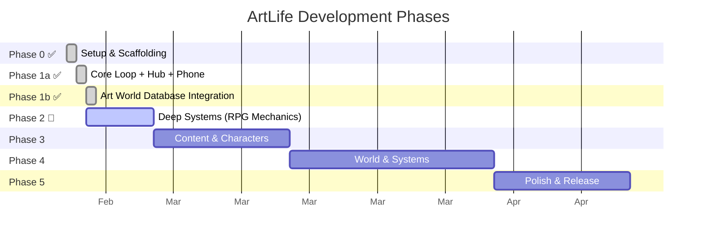

# 🗺️ Development Roadmap

> Phased plan from prototype to full game.

---

## Overview

---

## ✅ Phase 0 — Setup & Scaffolding (Done)

- [x] Vite + Phaser 3 project initialized
- [x] Scenes: Boot, Menu, CharacterSelect, Game, Dialogue, End
- [x] Managers: GameState, MarketManager, EventManager, PhoneManager
- [x] Data: events (34), contacts (11), artists (8), calendar (16)
- [x] Noir background art (7 category images generated)
- [x] Git repo, working skeleton

---

## ✅ Phase 1a — Core Loop + Hub + Phone (Done)

- [x] Hub layout redesign (3-panel: portfolio, center tabs, Nokia phone)
- [x] Phone UI with messages, NPC contacts, unread counts
- [x] Message modal with urgency styling and action buttons
- [x] Center tabs: Market, Calendar, Intel
- [x] Oregon Trail-style event pacing (~75% event/turn)
- [x] Category-based dialogue backgrounds with typewriter text
- [x] Character class system (3 starter classes)
- [x] Buy/sell works, portfolio tracking, market states

---

## ✅ Phase 1b — Art World Database Integration (Done)

- [x] 15 new scandal events (forgery, fraud, shill bidding, freeport, provenance…)
- [x] 5 new NPC archetypes (mega-dealer, speculator, hustler, advisor, institutional)
- [x] Anti-resource system: marketHeat, suspicion, flipHistory, dealerBlacklisted
- [x] Gallery buyback simulation + flipper price penalties in MarketManager
- [x] Calendar enriched to 22 events with costs, NPC presence, deal opportunities
- [x] Anti-resource display in top bar + Intel tab

---

## 🔴 Phase 2 — Deep Systems / RPG Mechanics (Current Sprint)

**Goal:** Transform from "event loop" to "strategic narrative RPG" using the 12 stealable mechanics from the Text RPG Research.

### Quality Gates + Blue Options (from FTL + Fallen London)
| Task | Details |
|---|---|
| Build `QualityGate` engine | Requirements checker: min/max/equals/dotted paths |
| Add requirements to events | Gate 10+ events behind player progress |
| Blue Options on event choices | Choices gated by stats, shown as 🔵 with gold border |
| Locked choice hints | Dimmed choices show "[Requires: Rep 60]" |

### Consequence Scheduler (from King of Dragon Pass)
| Task | Details |
|---|---|
| Build `ConsequenceScheduler` | Queue + tick system for delayed effects |
| Schedule from event choices | `schedules: [...]` on 10+ events |
| Support types | phone_message, event, stat_change, news |
| Conditional triggers | Runtime checks (e.g., only fire if rep > 40) |

### Decision Journal (from Sir Brante)
| Task | Details |
|---|---|
| Build `DecisionLog` manager | Rich logging with context, tags, NPC links |
| Add Journal tab to GameScene | 4th center tab showing visual timeline |
| Query methods | getByTag, getByNPC, getByWeekRange |

### NPC Memory + Autonomy (from Overboard!)
| Task | Details |
|---|---|
| Expand contact state with `memory` | witnessed, grudges, favors, lastContact |
| NPC autonomous tick | Favor decay, pending offer expiry, memory references |
| Memory-aware message generation | NPCs reference past decisions in messages |

### Burnout Anti-Resource (from Sunless Sea)
| Task | Details |
|---|---|
| Add `burnout` to GameState | Rises from consecutive events, high heat, scandal clusters |
| Forced rest at threshold | Skip player actions for 1 turn + notification |

---

## Phase 3 — Content & Characters (~2 weeks)

**Goal:** Expand from prototype to a game with real depth.

| Task | Details |
|---|---|
| Add remaining character classes | Gallery Insider, Speculator, Curator |
| Expand artist pool to 15–20 | Mix of emerging/mid-career/blue-chip |
| Write 20+ additional events | Including multi-turn scenarios + character-specific arcs |
| Implement perk system | Unlockable perks from Perks_and_Bonuses.md |
| Add provenance & rarity to valuation | Full valuation formula |
| Character-specific events | Rich Kid inheritance, Hedge Fund bonus, etc. |
| Increase turn count to 52+ | Full in-game year |
| Stat evolution | Character specialization at Week 20 milestone |
| Attitude dial | Tone selector for NPC interactions (5 tones) |

---

## Phase 4 — World & Systems (~3 weeks)

**Goal:** Add the strategic depth that makes the game truly strategic.

| Task | Details |
|---|---|
| Multi-location system | New York, Basel, London, Miami, Venice |
| City Hub Overworld | Walk between locations via `CityScene` and fast-travel Taxis |
| Freeport mechanics | Store, defer tax, freeport-to-freeport sales |
| **Advanced Auction System** | Variable rules: English, Sealed Bid, One-Offer, Double Auction |
| **Economic Warfare** | Short selling, rumor mill, "Poorest Loses" crash events |
| Multi-turn event chains | Breakout Artist, Market Crash, Rival Collector arcs |
| 2–3 actions per turn | Meaningful trade-offs between actions |
| Save/load system | localStorage-based persistence |
| Progressive disclosure | Phase UI reveals into early/mid/late game |
| Board seats & art fund management | Late-game institutional mechanics |

---

## Phase 5 — Polish & Release (~2 weeks)

| Task | Details |
|---|---|
| Full pixel art pass | Character portraits, scene backgrounds, UI polish |
| 8-bit noir visual effects | CRT overlay, scanlines, vignette, grain |
| Sound design | Chiptune/ambient soundtrack, event SFX |
| Typewriter text enhancements | Variable speed, dramatic pauses |
| Tutorial / onboarding | First-time player guidance |
| Playtesting & balance | Tune market math, event frequency, difficulty |
| Publish on itch.io | Package, page, screenshots |

---

## Stretch Goals (Post-Release)

| Feature | Description |
|---|---|
| Multiplayer auction mode | Competitive bidding against other players |
| Procedural artist generation | Infinite content from templates |
| Mobile-responsive UI | Play on phone/tablet |
| Full 5-location world | Venice, Hong Kong, São Paulo |
| Seasonal content events | Real-world art market calendar tie-ins |
| Steam release | Desktop packaging via Electron or Tauri |

---

## Tags
#project #roadmap #planning #game-design
